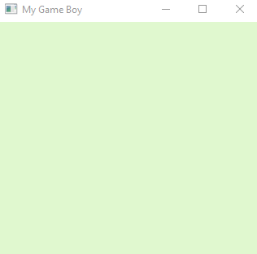

# My gameboy emulator

### Intro:
  + This is a gaemboy emulator written in **pure C** and **Win32 api**. So it's just for windows.
  + Currently can basically running while it's still buggy. But I'm still working on it, these bugs will be fixed soon.
### Compile:
  + For windows, when `msbuild` is in your PATH, you can use the build.bat to build it. 
  + For other situations, just manually use CMake workflow to compile, that's pretty simple.
### Distribution:
  + While the gameboy ROMs in assets folder are belong to corresponding company, be careful. They can be used only for learning purpose.
  + Except from that, other codes are distributed under WTFPL license.